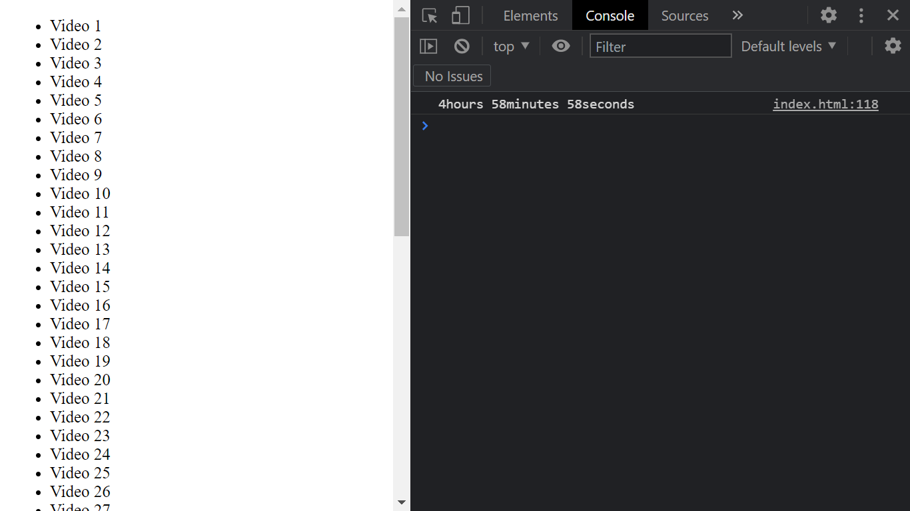

# JS-30-DAY-18

<h1 align=center> Adding up times with Reduce </h1>

## [demo](https://cenacrharsh.github.io/JS-30-DAY-18/)

## [BLOG](https://dev.to/cenacr007_harsh/javascript-30-day-18-3h8f)

## Lessons Learned:
- used `Array.prototype.reduce` and `Array.prototype.map`
